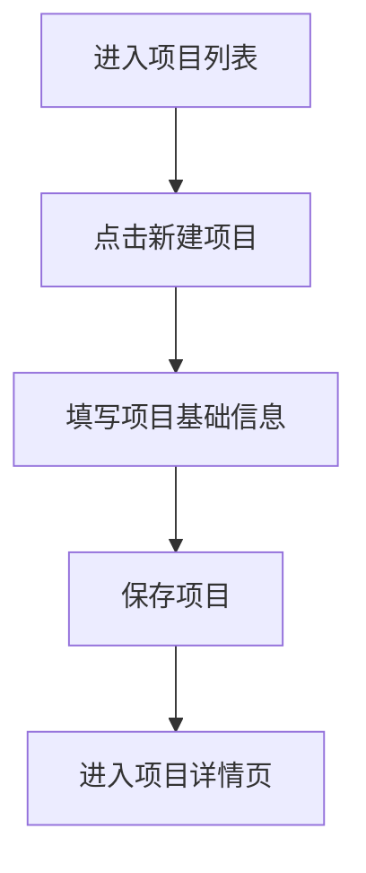
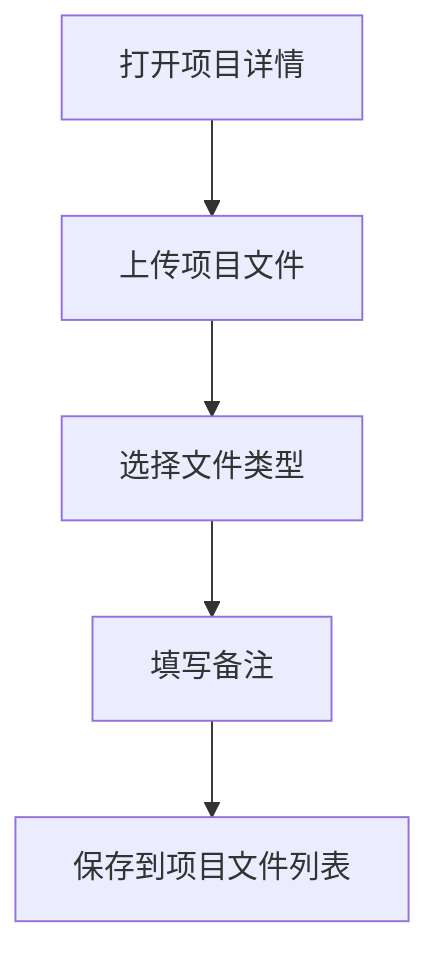
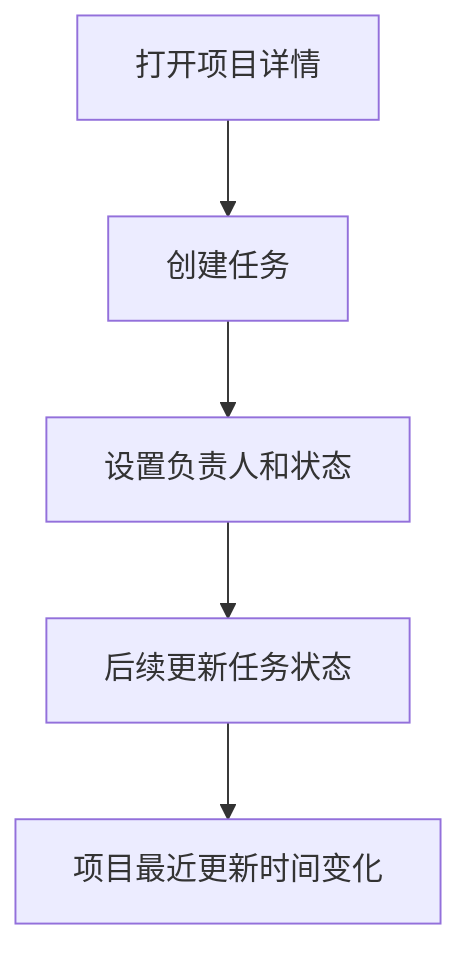

# 小型企业研发项目管理系统 MVP PRD

## 1. 文档信息

| 项目 | 内容 |
|---|---|
| 产品名称 | 研发项目管理系统 / R&D Project Management System |
| 文档类型 | MVP 产品需求文档 PRD |
| 版本 | V0.1 |
| 面向对象 | 小型企业研发部门 |
| 核心用户 | 老板 / 研发负责人 / 研发员工 |
| 当前阶段 | MVP 需求定义 |

## 2. 项目背景

经过与客户访谈，目前该企业研发部门规模较小，算上老板仅约 3 人。团队在日常研发工作中并不需要一套复杂的大型 ERP 系统，而是更需要一个轻量、易用、可持续维护的信息管理工具。

当前研发项目信息和相关文件可能分散在微信聊天、Excel 表格、个人电脑文件夹、纸质记录、口头沟通等不同位置，导致项目资料不统一、历史记录难追溯、文件容易遗漏、项目进度不够清晰。

因此，MVP 阶段的产品定位不是完整 ERP，而是一个面向小型研发团队的轻量级研发项目管理系统，优先解决项目信息归档、文件集中管理、项目进度记录和任务追踪问题。

## 3. 产品定位

本系统面向小型企业研发部门，旨在解决研发项目信息分散、文件管理不规范、项目进度难以追踪等问题。第一阶段系统将以轻量级研发项目管理为核心，支持项目建档、文件归档、进度记录、任务追踪和基础查询，帮助团队建立统一、可持续维护的研发信息管理流程。

## 4. MVP 目标

### 4.1 产品目标

1. 建立统一的研发项目资料库。
2. 让每个研发项目拥有独立、清晰、可查询的项目档案。
3. 集中管理项目相关文件，减少文件丢失和重复查找。
4. 记录项目当前状态和关键进度，方便老板和员工快速了解项目情况。
5. 用简单任务记录替代零散口头提醒，提升小团队协作效率。

### 4.2 不做什么

MVP 阶段暂不做完整 ERP 功能，包括但不限于：

1. 财务管理。
2. 采购审批。
3. 库存管理。
4. 生产排程。
5. 人事管理。
6. 复杂权限系统。
7. 复杂甘特图或自动化流程引擎。
8. 与其他企业系统深度集成。

## 5. 用户与角色

| 角色 | 用户特征 | 核心需求 |
|---|---|---|
| 老板 / 管理者 | 需要掌握所有研发项目情况，但不一定每天录入信息 | 查看项目进度、查找项目文件、了解任务是否完成 |
| 研发负责人 | 负责推进项目、整理资料、协调任务 | 创建项目、更新状态、上传文件、分配任务 |
| 研发员工 | 参与具体研发、测试、打样、文件整理 | 查看自己相关任务、上传文件、补充进度记录 |

MVP 阶段建议权限简化为两类：

| 权限类型 | 可执行操作 |
|---|---|
| 管理员 | 创建/编辑/删除项目，管理文件，查看全部项目和任务 |
| 普通成员 | 查看项目，上传文件，编辑自己负责的任务和进度记录 |

如开发成本需要进一步降低，Demo 阶段可暂时不做复杂权限，仅保留登录和基础身份区分。

## 6. 核心使用场景

### 场景 1：老板想快速查看所有研发项目进展

老板进入系统后，可以在项目列表中看到所有项目名称、负责人、当前状态、最近更新时间和下一步任务，快速判断哪些项目正在推进、哪些项目暂停或需要关注。

### 场景 2：研发人员需要整理一个新项目

研发人员创建新项目，填写项目名称、客户/产品、开始时间、负责人、项目状态、项目备注，并上传客户需求、图纸、报价单、BOM 表、测试记录等文件。

### 场景 3：团队需要查找某个历史项目文件

用户通过项目名称、客户名称、项目状态或负责人搜索项目，进入项目详情页后查看该项目下的所有文件，避免在多个文件夹和聊天记录中反复查找。

### 场景 4：项目推进中需要记录下一步任务

研发负责人在项目详情页添加任务，例如“完成第一版 BOM 表”“联系客户确认尺寸”“整理测试照片”，并设置负责人、截止时间和完成状态。

## 7. MVP 功能范围

### 7.1 功能优先级

| 模块 | 功能 | 优先级 | MVP 是否包含 |
|---|---|---:|---|
| 项目管理 | 创建项目 | P0 | 是 |
| 项目管理 | 项目列表 | P0 | 是 |
| 项目管理 | 项目详情页 | P0 | 是 |
| 项目管理 | 编辑项目基础信息 | P0 | 是 |
| 项目管理 | 项目状态管理 | P0 | 是 |
| 文件管理 | 项目文件上传 | P0 | 是 |
| 文件管理 | 项目文件列表 | P0 | 是 |
| 文件管理 | 文件下载/查看 | P0 | 是 |
| 任务管理 | 创建项目任务 | P0 | 是 |
| 任务管理 | 修改任务状态 | P0 | 是 |
| 任务管理 | 任务负责人和截止日期 | P1 | 是 |
| 查询筛选 | 按项目名称搜索 | P0 | 是 |
| 查询筛选 | 按状态/负责人筛选 | P1 | 是 |
| 用户权限 | 登录 | P1 | 建议包含 |
| 用户权限 | 老板/员工角色 | P2 | 可简化 |
| 数据统计 | 项目数量统计 | P2 | 可选 |
| 数据统计 | 文件数量统计 | P2 | 可选 |

## 8. 功能需求说明

### 8.1 项目管理

#### 8.1.1 项目列表

用户进入系统后首先看到项目列表。

项目列表应展示：

| 字段 | 说明 |
|---|---|
| 项目名称 | 研发项目名称 |
| 客户/产品 | 对应客户或产品名称 |
| 负责人 | 当前项目主要负责人 |
| 项目状态 | 当前项目进度阶段 |
| 开始时间 | 项目创建或启动时间 |
| 最近更新 | 最近一次编辑、上传文件或更新任务的时间 |

项目状态建议包括：

| 状态 | 含义 |
|---|---|
| 未开始 | 已建档，但尚未正式推进 |
| 进行中 | 正在研发或沟通 |
| 打样中 | 正在样品制作或试制 |
| 测试中 | 正在测试、验证或调整 |
| 已完成 | 项目已结束并归档 |
| 暂停 | 项目暂时停止推进 |

#### 8.1.2 创建项目

用户点击“新建项目”后填写项目基础信息。

必填字段：

| 字段 | 类型 | 是否必填 |
|---|---|---|
| 项目名称 | 文本 | 是 |
| 负责人 | 单选/文本 | 是 |
| 项目状态 | 单选 | 是 |

选填字段：

| 字段 | 类型 |
|---|---|
| 客户名称 | 文本 |
| 产品名称 | 文本 |
| 开始时间 | 日期 |
| 项目备注 | 长文本 |

#### 8.1.3 项目详情页

每个项目应有独立详情页，集中展示该项目的所有信息。

项目详情页包含：

1. 项目基础信息。
2. 当前项目状态。
3. 项目相关文件。
4. 项目任务列表。
5. 项目备注或进度记录。

### 8.2 文件管理

文件管理是 MVP 的核心功能之一。所有文件都应归属到具体项目下。

#### 8.2.1 上传文件

用户可在项目详情页上传文件。

文件信息包括：

| 字段 | 说明 |
|---|---|
| 文件名称 | 默认使用上传文件名，可编辑 |
| 文件类型 | 如图纸、BOM、报价单、测试记录、照片、客户需求、其他 |
| 上传人 | 系统自动记录 |
| 上传时间 | 系统自动记录 |
| 备注 | 可选 |

#### 8.2.2 文件列表

项目详情页中应展示该项目下的所有文件。

文件列表应支持：

1. 查看文件名称。
2. 查看文件类型。
3. 查看上传时间。
4. 下载或打开文件。
5. 删除文件。

MVP 阶段可以先不做复杂的版本管理，但建议保留上传时间，方便用户判断哪个文件较新。

### 8.3 任务管理

任务管理用于记录项目下一步需要做什么，避免依赖口头提醒。

#### 8.3.1 创建任务

任务字段包括：

| 字段 | 类型 | 是否必填 |
|---|---|---|
| 任务标题 | 文本 | 是 |
| 所属项目 | 自动关联 | 是 |
| 负责人 | 单选/文本 | 是 |
| 截止时间 | 日期 | 否 |
| 任务状态 | 单选 | 是 |
| 任务备注 | 长文本 | 否 |

任务状态建议包括：

| 状态 | 含义 |
|---|---|
| 待处理 | 任务已创建但尚未完成 |
| 进行中 | 任务正在处理 |
| 已完成 | 任务已完成 |
| 暂停 | 暂时不处理 |

#### 8.3.2 修改任务状态

用户可以在任务列表中快速修改任务状态。任务状态变更后，系统应更新项目最近更新时间。

### 8.4 查询与筛选

MVP 阶段需要支持基础查询能力，帮助用户快速找到项目和资料。

应支持：

| 查询方式 | 说明 |
|---|---|
| 项目名称搜索 | 输入关键词搜索项目 |
| 客户/产品搜索 | 根据客户或产品名称查找 |
| 状态筛选 | 按未开始、进行中、打样中等筛选 |
| 负责人筛选 | 查看某个人负责的项目 |

## 9. 页面结构

MVP 建议包含以下页面：

| 页面 | 主要内容 |
|---|---|
| 登录页 | 用户登录系统 |
| 项目列表页 | 查看、搜索、筛选所有项目 |
| 新建/编辑项目页 | 创建或修改项目基础信息 |
| 项目详情页 | 查看项目详情、文件、任务和备注 |
| 文件上传弹窗/页面 | 上传项目相关文件 |
| 任务创建/编辑弹窗 | 添加或修改项目任务 |

## 10. 基础流程

### 10.1 新建项目流程

### 10.2 项目资料归档流程

### 10.3 任务追踪流程

## 11. 数据对象设计

### 11.1 Project 项目

| 字段 | 示例 |
|---|---|
| project_id | P0001 |
| project_name | XX 产品结构优化项目 |
| client_name | XX 客户 |
| product_name | XX 产品 |
| owner | 张三 |
| status | 进行中 |
| start_date | 2026-06-24 |
| note | 客户要求优化尺寸和材料 |
| created_at | 2026-06-24 10:00 |
| updated_at | 2026-06-24 11:00 |

### 11.2 File 文件

| 字段 | 示例 |
|---|---|
| file_id | F0001 |
| project_id | P0001 |
| file_name | BOM_v1.xlsx |
| file_type | BOM |
| file_url | /uploads/BOM_v1.xlsx |
| uploaded_by | 李四 |
| uploaded_at | 2026-06-24 11:00 |
| note | 第一版 BOM |

### 11.3 Task 任务

| 字段 | 示例 |
|---|---|
| task_id | T0001 |
| project_id | P0001 |
| task_title | 完成第一版测试记录 |
| assignee | 王五 |
| due_date | 2026-06-30 |
| status | 待处理 |
| note | 需要补充测试照片 |
| created_at | 2026-06-24 11:30 |
| updated_at | 2026-06-24 11:30 |

## 12. 非功能需求

| 类型 | 要求 |
|---|---|
| 易用性 | 界面应简单直观，避免复杂操作流程 |
| 性能 | 项目列表、搜索和详情页应在常规数据量下快速响应 |
| 可靠性 | 文件上传后应稳定保存，避免资料丢失 |
| 可维护性 | 数据结构应清晰，方便后续扩展采购、库存、财务等模块 |
| 安全性 | 至少需要登录后访问；文件不应被未授权用户直接访问 |
| 兼容性 | 优先支持电脑端浏览器使用，后续可考虑移动端适配 |

## 13. MVP 验收标准

MVP 完成后，应满足以下条件：

1. 用户可以创建、查看、编辑研发项目。
2. 用户可以在项目列表中搜索和筛选项目。
3. 每个项目都有独立详情页。
4. 用户可以在项目详情页上传、查看和下载文件。
5. 用户可以为项目创建任务，并修改任务状态。
6. 项目状态可以被手动更新。
7. 老板或管理者可以通过系统快速了解所有项目当前情况。
8. 系统能替代一部分 Excel、微信和本地文件夹中的散乱记录。

## 14. 成功指标

MVP 上线或试用后，可从以下指标判断是否有效：

| 指标 | 目标 |
|---|---|
| 项目建档率 | 主要研发项目都能被录入系统 |
| 文件归档率 | 项目关键文件能上传到对应项目下 |
| 查找效率 | 用户能在较短时间内找到项目和文件 |
| 使用频率 | 团队成员愿意在项目推进时更新记录 |
| 信息完整度 | 项目名称、负责人、状态、文件等核心信息较完整 |

## 15. 后续版本方向

MVP 验证成功后，可逐步扩展：

1. 文件版本管理。
2. 项目进度时间线。
3. BOM 管理。
4. 物料/库存关联。
5. 采购需求记录。
6. 客户需求变更记录。
7. 项目数据统计看板。
8. 消息提醒和截止日期提醒。
9. 更细的角色权限。
10. 与企业现有表格或文件夹的数据导入。

## 16. 当前待确认问题

在进入原型或开发前，建议继续向客户确认：

1. 他们现在最常管理的研发项目类型是什么？
2. 每个项目通常必须保存哪些文件？
3. 老板最常查看哪些信息？
4. 研发员工是否愿意每天或每周更新项目状态？
5. 文件是否需要版本管理，还是 MVP 阶段只需要按时间上传即可？
6. 是否需要从现有 Excel 表格导入历史项目？
7. 是否需要手机端查看，还是电脑端优先？

## 17. MVP 开发建议

建议第一版按照以下顺序开发：

1. 项目列表与项目详情。
2. 新建和编辑项目。
3. 文件上传与文件列表。
4. 任务创建与状态修改。
5. 搜索和筛选。
6. 登录和基础权限。
7. 简单数据统计。

第一版应坚持轻量原则，优先保证团队真的愿意录入、查找和维护信息。对小企业研发部门而言，系统的价值不在于功能复杂，而在于让过去分散、模糊、容易丢失的信息变得集中、清晰、可追踪。
